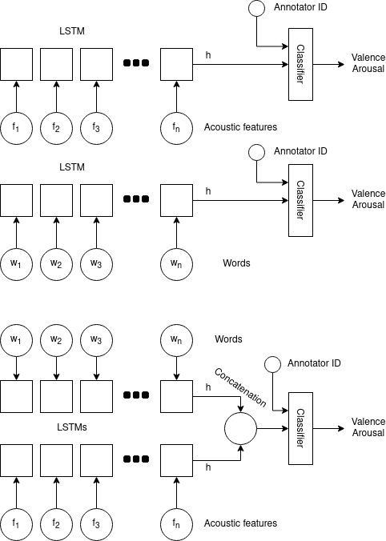
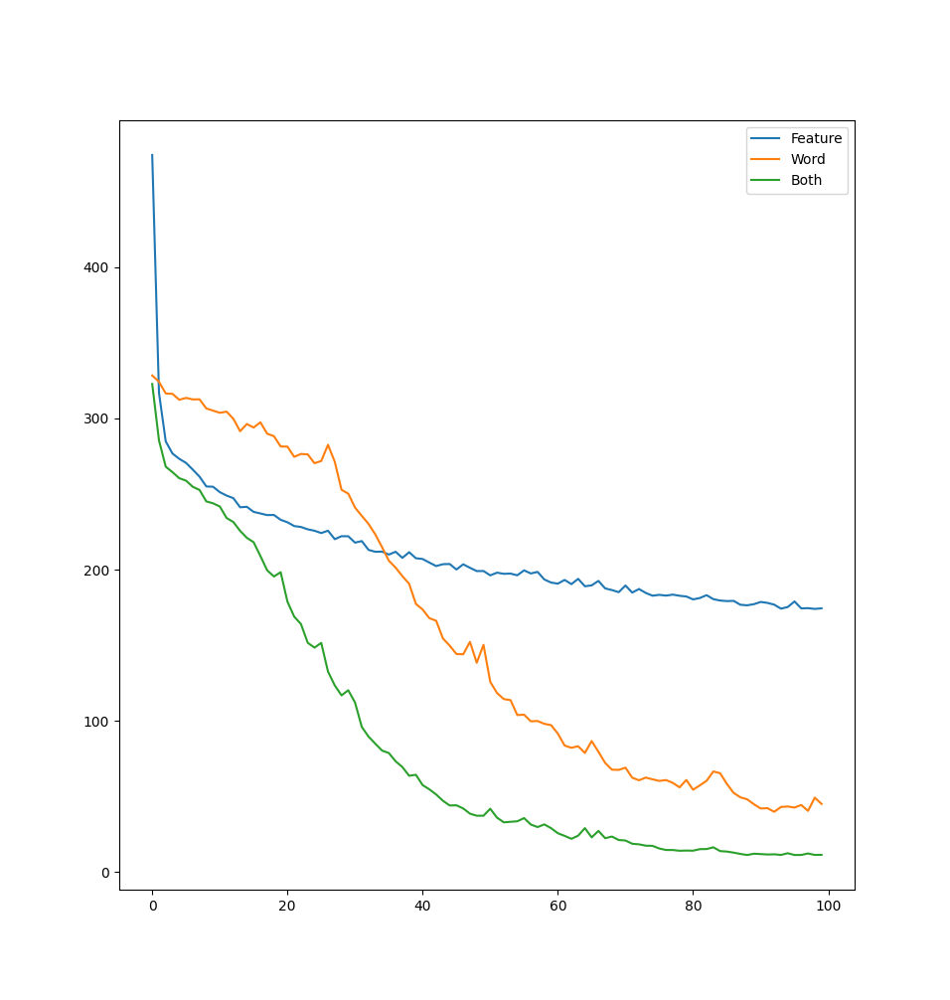

# Emotion prediction with attention networks

## 2021/5/11
This week, I experimented with different models for predicting emotion values from IPU features, words, and both together. I decided to set aside the attention model for now (just so I can have some kind of reasonble baseline to compare it with), and the simpler network architectures yielded some good results.

Before going too deep into this, I want to be clear about what of this work I'm intending to submit as a report for the end of semester and what I want to bring back to the lab and continue working on.

For the project:
* Predicting valence and arousal with acoustic features, words, and both together. Use as baselines. (Done)
* Predicting valence and arousal with acoustic features, words, and both together in an attention network. Evaluate performance against the baselines. (WIP)
* Evaluating attention network output in terms of which features were important for different valence/arousal values. (WIP)

For the lab:
* Treat the LSTM output as an emotional embedding. LSTM is encoder, classifier is decoder.
* Disentangle the embedding from individual annotator bias.
   * Train with 2/3 annotators. Freeze LSTM, train new classifier on 3rd annotator as evaluation (WIP)
   * Train with all 3 annotators at once. No way to evaluate, at least with annotators.
   * Predict subsequent turn emotions from prior turn's emotional embedding.


I used three separate network architectures, shown below:




The results are what I expected.

Visualization of test loss for each network design during training:



The results are what I expected. Acoustic features alone are OK at predicting arousal but bad at valence, and in general do not contain enough information to make a good guess. Words are slightly better at predicting valence than arousal, but did OK for arousal too. But using both together produces the best predictions.

Final MSE:

|               | Acoustic features  | Words              | Combined           |
|---------------|--------------------|--------------------|--------------------|
| MSE           | 174.37940883636475 | 44.991398334503174 | 11.330994129180908 |
| MSE (Valence) | 226.79624366760254 | 40.473445534706116 | 12.181115448474884 |
| MSE (Arousal) | 121.96257448196411 | 49.509350299835205 | 10.480872869491577 |


I also started playing around with the idea that you could disentangle annotator bias from an emotion embedding, in this case the output of the LSTM. These are some preliminary results, but I'm not going to look into it too deeply until after the semester is over. I trained the LSTM against 2 of the 3 annotators (CD+TL), froze it, then trained a new classifier for a single annotator (CD+TL -> VP). 


|                            | Acoustic features  | Words              | Both               |
|----------------------------|--------------------|--------------------|--------------------|
| MSE (CD+TL)                | 535.8995912613407  | 253.77809438397807 | 129.47808542559224 |
| MSE (CD+TL -> VP)          | 106.4106674194336  | 33.48297345638275  | 8.373867243528366  |
| MSE (Valence, CD+TL)       | 595.4207871960056  | 229.7104009812878  | 130.25078361265122 |
| MSE (Valence, CD+TL -> VP) | 164.59174060821533 | 33.6218376159668   | 6.473835974931717  |
| MSE (Arousal, CD+TL)       | 476.37839827998994 | 277.8457794189453  | 128.70538920740927 |
| MSE (Arousal, CD+TL -> VP) | 48.22959351539612  | 33.34410870075226  | 10.273898541927338 |


## 2021/4/20

I've been implementing a hierarchical attention network modeled after this paper: https://www.cs.cmu.edu/~./hovy/papers/16HLT-hierarchical-attention-networks.pdf

It's trying to do a binary classification of either valence or arousal, and it will do it either from words alone or from acoustic-prosodic features. The attention network is capable of focusing on individual words and individual features, if available.

Right now it is having difficulty converging, and I'm not sure if the network is too complex for the amount of data we have available (this is very possible) or if it's just a difficult task.

Valence with A/P features:

```
              precision    recall  f1-score   support

           0       0.55      0.16      0.25       158
           1       0.68      0.93      0.78       296

    accuracy                           0.66       454
   macro avg       0.61      0.55      0.52       454
weighted avg       0.63      0.66      0.60       454
```

Valence without A/P features:

```
              precision    recall  f1-score   support

           0       0.51      0.16      0.24       158
           1       0.67      0.92      0.78       296

    accuracy                           0.65       454
   macro avg       0.59      0.54      0.51       454
weighted avg       0.62      0.65      0.59       454
```


Arousal with A/P features:

```
              precision    recall  f1-score   support

           0       0.57      0.21      0.31        75
           1       0.86      0.97      0.91       379

    accuracy                           0.84       454
   macro avg       0.72      0.59      0.61       454
weighted avg       0.81      0.84      0.81       454
```

Arousal without A/P features:

```
              precision    recall  f1-score   support

           0       0.00      0.00      0.00        75
           1       0.83      1.00      0.91       379

    accuracy                           0.83       454
   macro avg       0.42      0.50      0.45       454
weighted avg       0.70      0.83      0.76       454
```