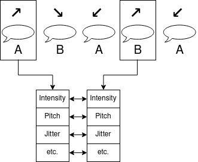
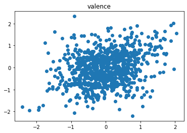
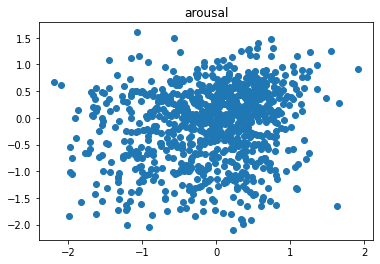
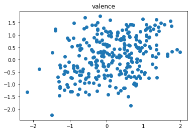
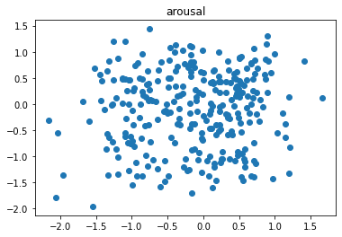

# Emotion Entrainment Log

## 2021/4/27

I've been working with Andreas to standardize the feature extraction process. From this point on, all features are extracted in line with the new process we developed.

This week I looked at whether speakers entrain on acoustic-prosodic features when experiencing similar emotions. This analysis differs from prior analysis in the following ways:

* Emotions were averaged over turns by annotator. Multiple emotion annotations per turn were reduced to a single emotion.
* Single turn-level emotions were normalized by annotator, then averaged together to produce a single valence/arousal value.
* Averaged emotions were reduced to quadrants.
	* 1 (↗): Positive valence, positive arousal
	* 2 (↘): Positive valence, negative arousal
	* 3 (↙): Negative valence, negative arousal
	* 4 (↖): Negative valence, positive arousal
* Turn pairs were selected based on emotional similarity. Instead of selecting adjacent turns, I found the nearest response turn uttered by the conversational partner in the same emotion quadrant as the prompt turn.

As before, I am looking at this from a high-level perspective and not investigating individual sessions yet.

### Synchrony
(_p_ < 0.1 shown, * failed permutation test)

| ↗ v+a+         | r (Game) | p (Game) | dof (Game) | r (Conv) | p (Conv) | dof (Conv) |
|----------------|----------|----------|------------|----------|----------|------------|
| Intensity Mean | 0.06     | 0.017    | 1396       |          |          |            |
| Intensity Max  | 0.07     | 0.011    | 279        | 0.09     | 0.09     | 474        |

| ↘ v+a-         | r (Game) | p (Game) | dof (Game) | r (Conv) | p (Conv)    | dof (Conv) |
|----------------|----------|----------|------------|----------|-------------|------------|
| Intensity Mean |          |          |            | 0.38     | 0.00011     | 94         |
| Intensity Max  |          |          |            | 0.33     | 0.00095 (*) | 94         |
| Shimmer        | -0.14    | 0.016    | 277        |          |             |            |

| ↙ v-a-         | r (Game) | p (Game) | dof (Game) | r (Conv) | p (Conv) | dof (Conv) |
|----------------|----------|----------|------------|----------|----------|------------|
| Intensity Mean |          |          |            | 0.22     | 0.011    | 123        |
| Rate           |          |          |            | -0.18    | -0.18    | 123        |

| ↖ v-a+         | r (Game) | p (Game) | dof (Game) | r (Conv) | p (Conv)    | dof (Conv) |
|----------------|----------|----------|------------|----------|-------------|------------|
| Intensity Max  |          |          |            | 0.10     | 0.086       | 321        |
| Pitch Mean     |          |          |            | -0.15    | 0.0057      | 321        |
| Jitter         |          |          |            | 0.20     | 0.00015 (*) | 321        |
| NHR            |          |          |            | 0.19     | 0.00054     | 321        |

### Convergence
| ↗              | r (Game) | p (Game)   | dof (Game) | r (Conv) | p (Conv) | dof (Conv) |
|----------------|----------|------------|------------|----------|----------|------------|
| Intensity Mean |          |            |            | 0.08     | 0.082    | 474        |
| Intensity Max  |          |            |            | 0.08     | 0.072    | 474        |
| Pitch Mean     | 0.09     | 0.0013 (*) | 1396       |          |          |            |
| Jitter         | 0.07     | 0.0053     | 1396       |          |          |            |
| Shimmer        | 0.06     | 0.015      | 1396       | -0.13    | 0.0058   | 474        |

| ↘              | r (Game) | p (Game) | dof (Game) | r (Conv) | p (Conv)  | dof (Conv) |
|----------------|----------|----------|------------|----------|-----------|------------|
| Intensity Mean | 0.13     | 0.028    | 279        | -0.18    | 0.080     | 94         |
| Intensity Max  | 0.16     | 0.0069   | 279        |          |           |            |
| Pitch Mean     | 0.11     | 0.062    | 279        | 0.25     | 0.014 (*) | 94         |
| NHR            | 0.11     | 0.061    | 279        | 0.17     | 0.091     | 94         |

| ↙              | r (Game) | p (Game) | dof (Game) | r (Conv) | p (Conv) | dof (Conv) |
|----------------|----------|----------|------------|----------|----------|------------|
| Pitch Mean     | 0.18     | 0.0022   | 262        | 0.17     | 0.053    | 123        |
| Pitch Max      |          |          |            | -0.19    | 0.037    | 123        |
| Shimmer        |          |          |            | -0.22    | 0.016    | 123        |
| NHR            | 0.14     | 0.020    | 262        |          |          |            |

| ↖              | r (Game) | p (Game) | dof (Game) | r (Conv) | p (Conv) | dof (Conv) |
|----------------|----------|----------|------------|----------|----------|------------|
| Pitch Mean     | 0.05     | 0.088    | 1211       | 0.11     | 0.049    | 321        |
| Jitter         | -0.06    | 0.053    | 1203       |          |          |            |
| NHR            |          |          |            | 0.13     | 0.020    | 321        |

### Similarity
I am still trying to figure out how to compute this, since previous conceptions of turn-level similarity didn't depend on a variable like the emotional quadrant. Some concerns:

1. Finding turns of the same quadrant not adjacent to the analyzed turn pair seems a little strange, since the turn pairs themselves aren't necessarily adjacent anyway.
1. Finding turns of other quadrants seems like a good idea, but there is overlap between the valence/arousal value (for example, if I'm in quadrant 1 and look in quadrants 2, 3, and 4, then there is some overlapping valence and arousal on turns 2 and 4). Because it covers such a breadth of samples, there might be a kind of increased regression to the mean that we wouldn't see otherwise.
1. Finding turns of the opposite quadrant also seems like a good idea, but in some cases there are so few turns in some quadrants (2 is especially rare) that it may not be worth it.

I have tried numbers 1 and 2 above and seen widespread dissimilarity (i.e., the partner difference is much larger than the other distance) across most features in both games and conversations. This may or may not be useful, and I didn't want to spend too much time thinking about it until I figure out what the best way to compute it is.

## 2021/4/20

I tried asking a bunch of different questions about emotional differences at turns not necessarily related to previous entrainment measures. Some of this may be a repeat of earlier metrics, but some are new.

### Is there a turn-level linear relationship between a speaker's emotional state and their partner's utterances?
"I have a high emotional valence. Does that mean my partner has high shimmer?"

Games summary: There is a negative linear relationship between valence and mean/max intensity and a positive linear relationship between arousal and mean/max intensity.

Conversations summary: There may be a positive relationship between valence and max intensity.

	- Games
		- Valence
			- Mean intensity: Yes, negative. r=-0.19, p=8.53e-9, dof=904
			- Max intensity: Yes, negative.  r=-0.19, p=3.92e-9, dof=904
			- Mean pitch: No
			- Max pitch: No
			- Jitter: No
			- Shimmer: No
			- NHR: No (p=0.013 but fails permutation test)
			- Speaking rate: No
		- Arousal
			- Mean intensity: Yes, positive. r=0.19, p=8.29e-9, dof=904
			- Max intensity: Yes, positive. r=0.19, p=1.42e-8, dof=904
			- Mean pitch: No
			- Max pitch: No
			- Jitter: No
			- Shimmer: No
			- NHR: No
			- Speaking rate: No
	- Conversations
		- Valence
			- Mean intensity: No (p=0.02 but fails permutation test)
			- Max intensity: Maybe. r=0.15, p=0.011, dof=285
			- Mean pitch: No
			- Max pitch: No
			- Jitter: No
			- Shimmer: No
			- NHR: No
			- Speaking rate: No
		- Arousal
			- Mean intensity: No
			- Max intensity: No
			- Mean pitch: No
			- Max pitch: No
			- Jitter: No
			- Shimmer: No
			- NHR: No
			- Speaking rate: No

### Is there a turn-level linear relationship between a speaker's emotional state and their partner distance?
"I have a high emotioanl valence. Does that mean my partner is very similar to me in shimmer?"

Games summary: No such relationship exists for valence. However, for arousal, there are positive relationships for mean intensity, jitter, and shimmer partner distance.

Conversations summary: no such relationship exists for valence. However, for arousal, there is a positive relationship for NHR.

	- Games
		- Valence
			- Mean intensity: No
			- Max intensity: No
			- Mean pitch: No
			- Max pitch: No
			- Jitter: No
			- Shimmer: No
			- NHR: No
			- Speaking rate: No
		- Arousal
			- Mean intensity: Yes, positive. r=0.12, p=0.00027, dof=904
			- Max intensity: No
			- Mean pitch: No
			- Max pitch: No
			- Jitter: Yes, positive. r=0.11, p=0.00091, dof=891
			- Shimmer: Yes, positive. r=0.12, p=0.00057, dof=889
			- NHR: No
			- Speaking rate: No
	- Conversations
		- Valence
			- Mean intensity: No
			- Max intensity: No
			- Mean pitch: No
			- Max pitch: No
			- Jitter: No
			- Shimmer: No
			- NHR: No
			- Speaking rate: No
		- Arousal
			- Mean intensity: No
			- Max intensity: No
			- Mean pitch: No
			- Max pitch: No
			- Jitter: No
			- Shimmer: No
			- NHR: Yes, positive. r=0.15, p=0.0090, dof=285
			- Speaking rate: No
			
			
### Is there a turn-level linear relationship between a speaker's emotional state and the distance between their utterance and their partner's utterance?	
"I have a high emotional valence. Does that mean my partner and I are close to each other in shimmer?"

Games summary: No such relationship exists for valence. However, for arousal, there are positive relationships for mean intensity, jitter, and shimmer. This means that a high arousal is correlated with close proximity in mean intensity, jitter, and shimmer.

Conversations summary: no such relationship exists for valence. However, for arousal, there is a positive relationship for NHR.

	- Games
		- Valence
			- Mean intensity: No
			- Max intensity: No
			- Mean pitch: No
			- Max pitch: No
			- Jitter: No
			- Shimmer: No
			- NHR: No
			- Speaking rate: No
		- Arousal
			- Mean intensity: Yes, positive. r=0.12, p=0.00027, dof=904
			- Max intensity: No
			- Mean pitch: No
			- Max pitch: No
			- Jitter: Yes, positive. r=0.11, p=0.00091, dof=891
			- Shimmer: Yes, positive. r=0.12, p=0.00057, dof=889
			- NHR: No
			- Speaking rate: No
	- Conversations
		- Valence
			- Mean intensity: No
			- Max intensity: No
			- Mean pitch: No
			- Max pitch: No
			- Jitter: No
			- Shimmer: No
			- NHR: No
			- Speaking rate: No
		- Arousal
			- Mean intensity: No
			- Max intensity: No
			- Mean pitch: No
			- Max pitch: No
			- Jitter: No
			- Shimmer: No
			- NHR: Yes, positive. r=0.15, p=0.0090, dof=285
			- Speaking rate: No
	
### Is there a turn-level linear relationship between a speaker's positive/negative emotional states and their partner's utterances?
"Does a positive valence correlate with my partner's shimmer differently than a negative valence?"

Games summary: Positive valence does not correlate with partner feature values. However, negative valence correlates negatively with mean and max intensity. Positive arousal may positively correlate with mean intensity, while negative arousal may poisitively correlate with mean/max intensity and speaking rate.

Conversations summary: Positive valence does not correlate with partner feature values. However, negative valence correlates positively with mean and max intensity. Positive arousal does not correlate with partner feature values, but negative arousal correlates with max pitch and may correlate with mean intensity and mean pitch.

Conversations summary: no such relationship exists for valence. However, for arousal, there is a positive relationship for NHR.

	- Games
		- Positive Valence
			- Mean intensity: No
			- Max intensity: No
			- Mean pitch: No
			- Max pitch: No
			- Jitter: No
			- Shimmer: No
			- NHR: No
			- Speaking rate: No
		- Negative Valence
			- Mean intensity: Yes, negative. r=-0.15, p=0.00083, dof=465
			- Max intensity: Yes, negative. r=-0.16, p=0.00062, dof=465
			- Mean pitch: No
			- Max pitch: No
			- Jitter: No
			- Shimmer: No
			- NHR: No
			- Speaking rate: Yes, negative. r=-0.12, p=0.0093, dof=465
		- Positive Arousal
			- Mean intensity: Maybe, positive. r=0.12, p=0.011, dof=479
			- Max intensity: No (p=0.013 but failed permutation test)
			- Mean pitch: No
			- Max pitch: No
			- Jitter: No
			- Shimmer: No
			- NHR: No
			- Speaking rate: No
		- Negative Arousal
			- Mean intensity: Maybe, positive. r=0.11, p=0.026, dof=424
			- Max intensity: Maybe, positive. r=0.10, p=0.047, dof=424
			- Mean pitch: No
			- Max pitch: No (p=0.0095 but failed permutation test)
			- Jitter: No
			- Shimmer: No
			- NHR: No
			- Speaking rate: Maybe, negative. r=-0.10, p=0.034, dof=424
	- Conversations
		- Positive Valence
			- Mean intensity: No
			- Max intensity: No
			- Mean pitch: No
			- Max pitch: No
			- Jitter: No
			- Shimmer: No
			- NHR: No
			- Speaking rate: No
		- Negative Valence
			- Mean intensity: Yes, positive. r=0.28, p=0.0018, dof=122
			- Max intensity: Yes, positive. r=0.28, p=0.0021, dof=122
			- Mean pitch: No
			- Max pitch: No
			- Jitter: No
			- Shimmer: No
			- NHR: No
			- Speaking rate: No
		- Positive Arousal
			- Mean intensity: No
			- Max intensity: No
			- Mean pitch: No
			- Max pitch: No
			- Jitter: No
			- Shimmer: No
			- NHR: No
			- Speaking rate: No
		- Negative Arousal
			- Mean intensity: Maybe, positive. r=0.16, p=0.044, dof=153
			- Max intensity: No
			- Mean pitch: Maybe, positive. r=0.17, p=0.039, dof=153
			- Max pitch: Yes, positive. r=0.22, p=0.0059, dof=153
			- Jitter: No
			- Shimmer: No
			- NHR: No
			- Speaking rate: No

### Is there a turn-level linear relationship between a speaker's positive/negative emotional states and the distance between their utterance and their partner's utterance?
"Does a positive valence mean that my partner and I are closer to each other in shimmer than for negative valence?"

Games summary: Positive valence does not correlate with partner differences. However, negative valence may correlate slightly negatively with max pitch difference. Positive arousal may positively correlate with mean intensity differences, while negative arousal may poisitively correlate with mean/max intensity and speaking rate differences.

Conversations summary: Positive valence does not correlate with partner differences. However, negative valence may correlate negatively with jitter difference. Positive arousal does not correlate with partner differences. However, negative arousal may correlate negatively with max pitch difference.

	- Games
		- Positive Valence
			- Mean intensity: No
			- Max intensity: No
			- Mean pitch: No
			- Max pitch: No
			- Jitter: No (p=0.029 but failed permutation test)
			- Shimmer: No
			- NHR: No
			- Speaking rate: No
		- Negative Valence
			- Mean intensity: No
			- Max intensity: No
			- Mean pitch: No
			- Max pitch: Maybe, slightly negative. r=-0.10, p=0.04, dof=465
			- Jitter: No
			- Shimmer: No
			- NHR: No
			- Speaking rate: No
		- Positive Arousal
			- Mean intensity: No
			- Max intensity: No
			- Mean pitch: Yes, negative. r=-0.13, p=0.0053, dof=479
			- Max pitch: No
			- Jitter: No
			- Shimmer: No
			- NHR: No
			- Speaking rate: No
		- Negative Arousal
			- Mean intensity: Yes, positive. r=0.12, p=0.0073, dof=424
			- Max intensity: No
			- Mean pitch: No
			- Max pitch: No
			- Jitter: No
			- Shimmer: Maybe, positive. r=0.10, p=0.041, dof=414
			- NHR: No
			- Speaking rate: No
	- Conversations
		- Positive Valence
			- Mean intensity: No
			- Max intensity: No
			- Mean pitch: No
			- Max pitch: No
			- Jitter: No
			- Shimmer: No
			- NHR: No
			- Speaking rate: No
		- Negative Valence
			- Mean intensity: No
			- Max intensity: No
			- Mean pitch: No
			- Max pitch: No
			- Jitter: Maybe, negative. r=-0.18, p=0.051, dof=121
			- Shimmer: No
			- NHR: No
			- Speaking rate: No**
		- Positive Arousal
			- Mean intensity: No
			- Max intensity: No
			- Mean pitch: No
			- Max pitch: No
			- Jitter: No
			- Shimmer: No
			- NHR: No
			- Speaking rate: No
		- Negative Arousal
			- Mean intensity: No
			- Max intensity: No
			- Mean pitch: No
			- Max pitch: Maybe, negative. r=-0.18, p=0.02, dof=153
			- Jitter: No
			- Shimmer: No
			- NHR: No
			- Speaking rate: No

### Is there a turn-level difference between partner distances originating from a speaker's positive emotional states and partner distances originating from a speaker's negative emotional states?

"Are shimmer partner differences different when I have positive and negative valence?"
**
Games summary: Starting with negative valence may have smaller differences in max intensity and shimmer. Starting with positive arousal has smaller differences in mean intensity and jitter, and may have smaller differences in shimmer and NHR.

Conversations summary: There are no differences between starting with positive or negative valence. Starting with positive arousal may have smaller partner distances in shimmer and NHR.

	- Games
		- Valence
			- Mean intensity: No
			- Max intensity: Maybe, positive-led differences are larger. t=-1.89, p-0.059
			- Mean pitch: No
			- Max pitch: No
			- Jitter: No
			- Shimmer: Maybe, positive-led differences are larger. t=-2.29, p=0.022
			- NHR: No
			- Speaking rate: No
		- Arousal
			- Mean intensity: Yes, p**
			- Jitter: Yes, positive-led differences are smaller. t=3.58, p=0.00037
			- Shimmer: Maybe, positive-led differences are smaller. t=2.35, p=0.019
			- NHR: Maybe, positive-led differences are smaller. t=1.97, p=0.050
			- Speaking rate: Maybe, positive-led differences are larger. t=2.38, p=0.017
	- Conversations
		- Valence
			- Mean intensity: No
			- Max intensity: No
			- Mean pitch: No
			- Max pitch: No
			- Jitter: No
			- Shimmer: No
			- NHR: No
			- Speaking rate: No
		- Arousal
			- Mean intensity: No
			- Max intensity: No
			- Mean pitch: No
			- Max pitch: No
			- Jitter: No
			- Shimmer: Maybe, positive-led differences are smaller. t=1.90, p=0.058
			- NHR: Maybe, positive-led differences are smaller. t=1.94, p=0.054
			- Speaking rate: No
**
Games summary: For valence partner distance, there is a slightly positive correlation with mean pitch partner distance. For arousal partner distance, there is a positive correlation with speaking rate and mean and max intensity. There may be a slightly positive correlation with mean pitch and NHR.

Conversations summary: There are no relationships for valence partner distance. Arousal partner distance is positively correlated with mean intensity.

	- Games
		- Valence
			- Mean intensity: No
			- Max intensity: No
			- Mean pitch: Yes, slightly positive. r=0.09, p=0.0093, dof=889
			- Max pitch: No
			- Jitter: No
			- Shimmer: No
			- NHR: No
			- Speaking rate: No
		- Arousal
			- Mean intensity: Yes, positive. r=0.30, p=1.51e-19, dof=889
			- Max intensity: Yes, positive. r=0.27, p=9.13e-17, dof=889
			- Mean pitch: Maybe, slightly positive. r=0.044, dof=889
			- Max pitch: No
			- Jitter: No
			- Shimmer: No
			- NHR: Maybe, slightly positive. r=0.07, p=0.049, dof=889
			- Speaking rate: Yes, slightly positive. r=0.09, p=0.0049, dof=889
	- Conversations
		- Valence
			- Mean intensity: No
			- Max intensity: No
			- Mean pitch: No
			- Max pitch: No
			- Jitter: No
			- Shimmer: No
			- NHR: No
			- Speaking rate: No
		- Arousal
			- Mean intensity: Yes, positive. t=0.12, p=0.039, dof=280
			- Max intensity: No
			- Mean pitch: No
			- Max pitch: No
			- Jitter: No
			- Shimmer: No
			- NHR: No
			- Speaking rate: No

## 2021/04/13 Highlights
* Revisited old code, revised to make it more similar to the final B-MIC analysis code.
* Evaluated summary synchrony and local proximity on acoustic-prosodic features separately for positive and negative V/A

Starting a new log because the last one got overloaded with general entrainment work on B-MIC.

Some improvements since last time:
* General emotion entrainment measures are computed using speaker-normalized valence and arousal, computed over all V/A values from all annotators across all sessions for a single speaker.
* Turn-level emotion entrainmet is computed by comparing the mean of each of the 3 adjacent emotion annotations. If all 3 annotators left 1 annotation for a whole turn, then it is simply the mean of those 3 annotations. However, if an annotator left more than one emotion annotation, only the first/last annotation as appropriate is incorporated into the mean. This didn't make a huge difference in practice.
* Overlapping turns are skipped as they were in the original B-MIC analysis.

## Emotion/AP Distance Correlates
This section examines the difference between emotions and acoustic-prosodic features across turn exchanges. At turn exchanges where there is both an emotion annotation and a/p annotation for both speakers, we compute the difference of the emotion annotation and the difference of the a/p feature and compare them with Pearsons's correlation coefficient.

### Games
For game sessions, the difference in arousal is positively correlated with the difference in mean and max intensity, mean pitch, NHR, and speaking rate. The difference in valence is only positively correlated with a difference in max pitch.
|                | Valence r             | p                   | dof | Arousal r              | p                      |
|----------------|-----------------------|---------------------|-----|------------------------|------------------------|
| Mean intensity | -0.008063929987601543 | 0.8101473338583689  | 889 | 0.2967219569572294     | **1.5092739144479908e-19** |
| Max intensity  | -0.00900836135001011  | 0.788412217989601   | 889 | 0.2737820782753171     | **9.12746828814226e-17**   |
| Mean pitch     | 0.08715281692638693   | **0.00928670057727018** | 889 | 0.06750662849393714    | **0.04407434737947286**    |
| Max pitch      | 0.027720094933604816  | 0.40882314052579516 | 889 | -0.0397720654667957    | 0.23589243561240097    |
| Jitter         | 0.01154519617893882   | 0.730881093678039   | 889 | 0.05411359598276809    | 0.10668432458930513    |
| Shimmer        | 0.006401052194624063  | 0.8487643061586664  | 889 | -0.0017198304047841837 | 0.9591379411329057     |
| NHR            | 0.008737263854195432  | 0.7946352444423297  | 889 | 0.06594759059915516    | **0.04920833723355125**    |
| Rate           | 0.045180750096295706  | 0.17808822918116893 | 889 | 0.09975770328294557    | **0.002888979917956301**   |

### Conversations
There is no correlation between emotion difference and A/P differences at turn exchanges except for arousal and mean intensity (r=0.12351237225358844, p=0.03853251074475086, dof=280)

## Extreme emotion value entrainment
In this section, we examine the effect a speaker's emotional state has on his or her partner's entrainment behavior. We examine the emotion values in the first turn at turn exchanges, filtering out turn exchanges where the value does not pass a threshold value. The partner's emotional state is not considered.

### Similarity
#### Games
|                | Valenece >= 0 t | p      | dof  | Valence < 0 r | p     | dof |   | Arousal >= 0 t | p      | dof  | Arousal < 0 r | p       | dof |
|----------------|-----------------|--------|------|---------------|-------|-----|---|----------------|--------|------|---------------|---------|-----|
| Intensity mean |                 | NS     |      |               | NS    |     |   | -3.32          | 0.0009 | 1164 | 4.09          | 4.73e-5 | 835 |
| Intensity max  | -3.43           | 0.0006 | 1005 |               | NS    |     |   | -5.10          | 3.91   | 1164 |               | NS      |     |
| Pitch mean     |                 | NS     |      |               | NS    |     |   |                | NS     |      |               | NS      |     |
| Pitch max      |                 | NS     |      |               | NS    |     |   |                | NS     |      |               | NS      |     |
| Jitter         | -2.05           | 0.04   | 912  |               | NS    |     |   |                | NS     |      | -2.043        | 0.041   | 777 |
| Shimmer        |                 | NS     |      |               | NS    |     |   |                | NS     |      |               | NS      |     |
| NHR            |                 | NS     |      |               | NS    |     |   |                | NS     |      |               | NS      |     |
| Rate           |                 | NS     |      |        2.38   | 0.018 | 994 |   | 2.76           | 0.0059 | 1164 |               | NS      |     |

#### Conversations
|                | Valenece >= 0 t | p     | dof | Valence < 0 r | p       | dof |   | Arousal >= 0 t | p      | dof | Arousal < 0 r | p     | dof |
|----------------|-----------------|-------|-----|---------------|---------|-----|---|----------------|--------|-----|---------------|-------|-----|
| Intensity mean |                 | NS    |     |               | NS      |     |   |                | NS     |     |               | NS    |     |
| Intensity max  | -2.07           | 0.039 | 338 | -3.49         | 0.00057 | 278 |   | -3.11          | 0.0020 | 310 | -2.54         | 0.012 | 306 |
| Pitch mean     |                 | NS    |     |               | NS      |     |   | 2.44           | 0.015  | 308 |               | NS    |     |
| Pitch max      |                 | NS    |     | 2.02          | 0.044   | 276 |   |                | NS     |     |               | NS    |     |
| Jitter         |                 | NS    |     |               | NS      |     |   |                | NS     |     |               | NS    |     |
| Shimmer        |                 | NS    |     |               | NS      |     |   |                | NS     |     |               | NS    |     |
| NHR            |                 | NS    |     |               | NS      |     |   |                | NS     |     | -2.03         | 0.043 | 305 |
| Rate           | -2.00           | 0.046 | 338 |               | NS      |     |   |                | NS     |     |               | NS    |     |

### Synchrony
#### Games
For games, there doesn't appear to be a major difference in AP entrainment between positive and negative emotion values. Slight entrainment on jitter is present when valence < 0 and arousal >= 0, and there is no evidence for shimmer when arousal > 0. Entrainment on NHS is only present for arousal.

|                | Valenece >= 0 r | p        | dof  | Valence < 0 r | p       | dof |   | Arousal >= 0 r | p       | dof  | Arousal < 0 r | p        | dof |
|----------------|-----------------|----------|------|---------------|---------|-----|---|----------------|---------|------|---------------|----------|-----|
| Intensity mean | 0.19            | 5.42e-10 | 1005 | 0.12          | 0.00028 | 994 |   | .11            | 0.00015 | 1164 | 0.14          | 3.41e-05 | 835 |
| Intensity max  | 0.14            | 5.663-06 | 1005 | 0.09          | 0.0047  | 994 |   | 0.09           | 0.0024  | 1164 | 0.10          | 0.0025   | 835 |
| Pitch mean     |                 | NS       |      |               | NS      |     |   |                | NS      |      |               | NS       |     |
| Pitch max      |                 | NS       |      |               | NS      |     |   |                | NS      |      |               | NS       |     |
| Jitter         |                 | NS       |      | 0.08          | 0.011   | 952 |   | 0.07           | 0.018   | 1087 |               | NS       |     |
| Shimmer        | 0.07            | 0.04     | 903  | 0.07          | 0.042   | 951 |   |                | NS      |      | 0.09          | 0.014    | 772 |
| NHR            |                 | NS       |      |               | NS      |     |   | 0.09           | 0.0037  | 1162 | 0.11          | 0.0015   | 829 |
| Rate           |                 | NS       |      |               | NS      |     |   |                | NS      |      |               | NS       |     |

#### Conversations
Conversations show significant differences between positive and negative emotional values. When valence >= 0, there is evidence for synchrony over intensity max and pitch mean. When arousal >= 0, there is evidence for synchrony over intensity mean and max and mean pitch. There is no evidence for synchrony with negative valence or arousal.

|                | Valenece >= 0 r | p     | dof | Valence < 0 r | p  | dof |   | Arousal >= 0 r | p      | dof | Arousal < 0 r | p  | dof |
|----------------|-----------------|-------|-----|---------------|----|-----|---|----------------|--------|-----|---------------|----|-----|
| Intensity mean |                 | NS    |     |               | NS |     |   | 0.18           | 0.0017 | 310 |               | NS |     |
| Intensity max  | 0.11            | 0.043 | 338 |               | NS |     |   | 0.13           | 0.026  | 310 |               | NS |     |
| Pitch mean     | 0.13            | 0.018 | 337 |               | NS |     |   | 0.16           | 0.0040 | 308 |               | NS |     |
| Pitch max      |                 | NS    |     |               | NS |     |   |                | NS     |     |               | NS |     |
| Jitter         |                 | NS    |     |               | NS |     |   |                | NS     |     |               | NS |     |
| Shimmer        |                 | NS    |     |               | NS |     |   |                | NS     |     |               | NS |     |
| NHR            |                 | NS    |     |               | NS |     |   |                | NS     |     |               | NS |     |
| Rate           |                 | NS    |     |               | NS |     |   |                | NS     |     |               | NS |     |

## Global Emotion Entrainment

### Proximity

#### Partner vs. other distance
For valence, partners are significantly more similar to one another than to others in games (t=3.8464652335977143, p=0.00035984515799359436, dof=47) and conversations (t=2.0910731874299846, p=0.04481099918776943, dof=31). There is no significant difference between partners and others for arousal.

#### Partner vs self distance
For valence, partners are significantly more similar to one another than to themselves in games (t=3.62211689045235, p=0.0007145391979325383, dof=47) and conversations (t=2.973186033431553, p=0.0056599846403571335). For arousal, partners are more similar to one another only in games (t=2.016626883693224, p=0.04946831753014236, dof=47)

### Convergence
There is only weakly significant global divergence in arousal for games. t=-2.623045586392091, p=0.015203616417768481, dof=23.

## Local Emotion Entrainment

### Proximity
At turn exchanges, speakers are more similar to their partner at turn exchanges than they are to their partner at other random turns in the session for every measure except arousal in conversations.

|              | Valence                                                | Arousal                                                |
|--------------|--------------------------------------------------------|--------------------------------------------------------|
| Game         | t=5.299422498246197, **p=1.4603307540982257e-07**, dof=904 | t=4.887760461701219, p=**1.2064070558496025e-06**, dof=904 |
| Conversation | t=3.742898870335481, **p=0.00022000883786183595**, dof=285 | t=0.3533072628555414, p=0.7241192910753673, dof=285    |

### Convergence
When viewed in summary, convergence does not occur except a small divergence in game sessions (r = -0.11489340497616259, p = 0.0005340688510017756 dof = 904).

| # Game | valence r          | valence p             | valence dof | arousal r          | arousal p             | arousal dof | # Conv | valence r          | valence p             | valence dof | arousal r          | arousal p             | arousal dof |
|--------|--------------------|-----------------------|-------------|--------------------|-----------------------|-------------|--------|--------------------|-----------------------|-------------|--------------------|-----------------------|-------------|
| 1      | -0.48298654674511  | **0.009230068100982** | 27          | -0.224132588491783 | 0.251552321617664     | 27          |        |                    |                       |             |                    |                       |             |
| 2      | -0.289387432601789 | 0.120879827433481     | 29          | -0.097847703031388 | 0.606973418366247     | 29          |        |                    |                       |             |                    |                       |             |
| 3      | -0.23041043528125  | 0.229177367231746     | 28          | -0.135398577890785 | 0.483736273922137     | 28          | 11     | -0.245578325862032 | 0.207803316560256     | 27          | -0.236751772885114 | 0.225132504901716     | 27          |
| 4      | -0.269505748402117 | 0.192641965417455     | 24          | -0.026552403225386 | 0.899742269448427     | 24          | 12     | 0.42789055953933   | 0.126943236588855     | 13          | -0.379723942605323 | 0.180521664519935     | 13          |
| 5      | 0.106913450524941  | 0.517106549402064     | 38          | -0.226305132788364 | 0.165947767606218     | 38          | 13     | 0.24195179516601   | 0.233718186827718     | 25          | -0.230031168959948 | 0.258269988616336     | 25          |
| 6      | -0.126879145059516 | 0.545599189331315     | 24          | 0.303389392794623  | 0.140402949091512     | 24          | 14     | -0.173314616614563 | 0.452467320760046     | 20          | -0.389306708599834 | 0.081095424124772 (!) | 20          |
| 19     | -0.307921369444501 | 0.076453313564354     | 33          | 0.083116768384124  | 0.640262386511707     | 33          |        |                    |                       |             |                    |                       |             |
| 20     | -0.02465373448536  | 0.863654440392866     | 50          | -0.285531046837084 | **0.042250364048299** | 50          |        |                    |                       |             |                    |                       |             |
| 21     | 0.136481322484479  | 0.413896228387652     | 37          | -0.207533847383947 | 0.211206715525997     | 37          | 15     | 0.485962640047819  | **0.021846449820819** | 21          | 0.0651284784391    | 0.773382096485497     | 21          |
| 22     | -0.21209208011785  | 0.343347177426761     | 21          | -0.219594331786294 | 0.326138780914244     | 21          | 16     | 0.348662989978307  | 0.221803377564085     | 13          | 0.536547988892712  | **0.047917935160766** | 13          |
| 23     | 0.040842410776887  | 0.794834361927331     | 42          | -0.073435065828551 | 0.639792509715179     | 42          | 17     | 0.067451849840034  | 0.84378871176441      | 10          | 0.108511215329916  | 0.750803148715015     | 10          |
| 24     | -0.035148502681809 | 0.848542744723566     | 31          | 0.331019748197622  | 0.064228481678109     | 31          | 18     | 0.505940650944763  | 0.093301877136229     | 11          | 0.031508960380815  | 0.922560972023603     | 11          |
| 29     | -0.114817011961799 | 0.629795876818059     | 19          | -0.183333002994    | 0.43911390884934      | 19          |        |                    |                       |             |                    |                       |             |
| 30     | -0.191046188501885 | 0.271610448537459     | 34          | -0.132162413520757 | 0.449159776246277     | 34          |        |                    |                       |             |                    |                       |             |
| 31     | 0.388420300726319  | 0.060696693539972     | 23          | -0.441467375085676 | **0.030801409951655** | 23          | 39     | -0.191468490842248 | 0.596182534604958     | 9           | -0.708256561700202 | **0.021891042178953** | 9           |
| 32     | -0.294457040532065 | 0.121008315221725     | 28          | -0.302383293425421 | 0.110860726629395     | 28          | 40     | 0.489308170208411  | **0.008227721138623** | 27          | 0.246714418973245  | 0.205640901435747     | 27          |
| 33     | -0.130002780558835 | 0.493525135629652     | 29          | -0.355902640653201 | 0.053573990272341     | 29          | 41     | -0.084097360726468 | 0.709828155123769     | 21          | -0.585945535245738 | **0.004163066134896** | 21          |
| 34     | 0.180650552130479  | 0.421098012071282     | 21          | -0.254247556836477 | 0.253535650876058     | 21          | 42     | 0.096711838718771  | 0.711943168230615     | 16          | -0.043148656304809 | 0.869391932963836     | 16          |
| 47     | 0.34381589923231   | **0.012573800210225** | 51          | -0.103855980232059 | 0.463744148051454     | 51          |        |                    |                       |             |                    |                       |             |
| 48     | -0.069748093179016 | 0.549371452108428     | 75          | -0.231877846390591 | **0.04384993883687**  | 75          |        |                    |                       |             |                    |                       |             |
| 49     | 0.048716202734137  | 0.706910444363546     | 61          | 0.206364047554435  | 0.107568799419628     | 61          | 43     | -0.235446328987573 | 0.202290270442068     | 30          | -0.173085190232248 | 0.351776219879256     | 30          |
| 50     | 0.190158809854415  | 0.216318572097599     | 43          | -0.005611270695186 | 0.971163009845178 (!) | 43          | 44     | -0.305145645545873 | 0.462376400921774     | 7           | 0.345257618059804  | 0.402246866901121     | 7           |
| 51     | 0.009653630173963  | 0.94981618158777 (!)  | 44          | 0.015446516186166  | 0.919781889024809     | 44          | 45     | 0.088427142365805  | 0.835061385092202 (!) | 7           | 0.320707082837106  | 0.438634085305154     | 7           |
| 52     | -0.00995139555603  | 0.93483581101886      | 69          | -0.257912165286795 | **0.031114352263633** | 69          | 46     | 0.106561944370844  | 0.716919138103609     | 13          | -0.28531552949476  | 0.322771711612608     | 13          |

### Synchrony
I found synchrony is best viewed in summary, as it shows a pretty clear general trend. We get some nice graphs out of it, which is a little more intuitive to look at than just charts.

|              | Valence                                                                                | Arousal                                                                                 |
|--------------|----------------------------------------------------------------------------------------|-----------------------------------------------------------------------------------------|
| Game         | r = 0.29581054778739274, **p = 9.82658694514841e-20**    | r = 0.20432425029451187, **p = 5.511657581692854e-10**    |
| Conversation | r = 0.3190451967191962, **p = 3.453148612728739e-08**    | r = 0.0812930720714577, p = 0.1703624963432945        |