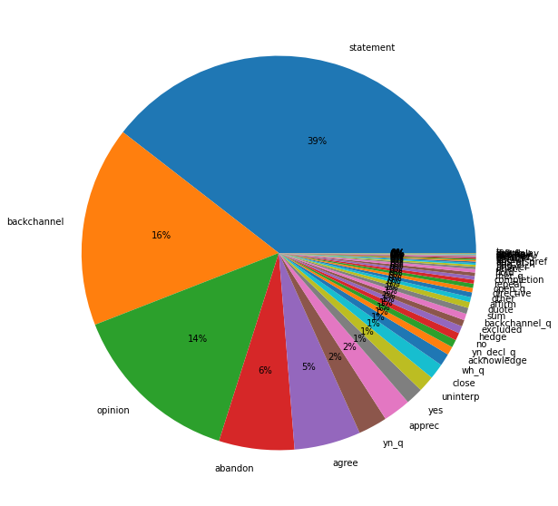
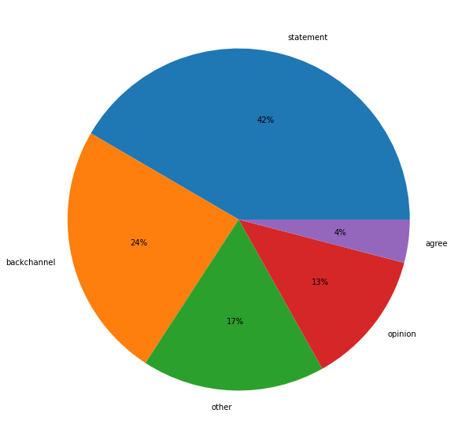
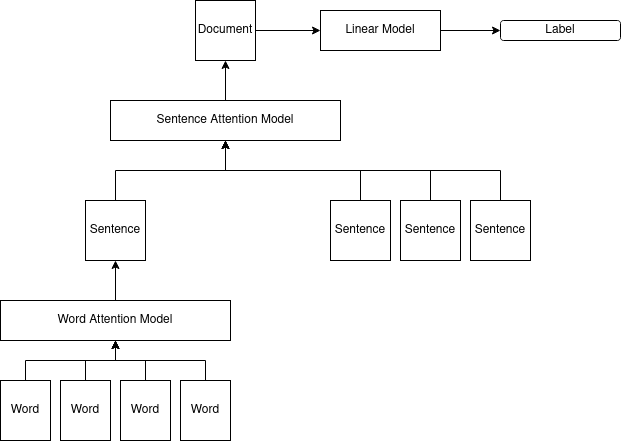
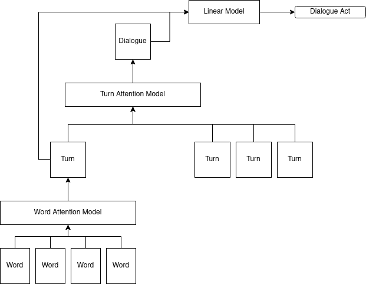

# Dialogue Act Annotation Project

### Introduction
I am trying to recreate the results in the paper "The contribution of dialogue act labels for convergence studies in natural conversations."

Here is what I am hoping to get out of this:

* I am new to dialogue act annotation. The method and analysis of this research is straightforward, so I'm hoping to focus on the annotations: how they're stored, what kind of processing I have to do to work with them, and so on.
* The paper uses a multilevel neural network to annotate turns with dialogue act labels. I have not used this neural network architecture before, so it is a good opportunity to learn about it.
* The lab is planning to annotate a similar corpus with dialogue act labels. By recreating this paper, I'll be in a better position to analyze our corpus once annotation is complete.

### Basics
The Switchboard corpus consists of 2,430 conversations between 543 speakers. For this work, I use the term "conversation ID" as the 4-digit ID of the conversation and "participant ID" as A or B designation given to each participant. Individual speakers have their own IDs, but for now I don't think it's useful to differentiate between them.

The Switchboard corpus includes transcripts of each conversation. Additionally, a later dataset added dialogue act annotation to approximately 25% of the conversations.

### Research Outline
To recreate the paper, I need to do the following:

Preparation
1. Create a train/test set from the dialogue act annotations.
	* Extract turns from Switchboard transcripts.
	* Extract dialogue act annotations.
	* Align dialogue act annotations with turns and remove duplicates.
	* Split into train/test datasets.
2. Train a model to predict the dialogue act.
	* Train word embeddings from transcripts.
	* Develop multilevel neural network architecture as described in the paper.
3. Apply the model to the unannotated Switchboard corpus.

Analysis
1. Extract energy, pitch, and speech rate from all turns.
2. Determine convergence without dialogue act filtering.
3. Determine convergence with filtering on statement, opinion, and backchannels.


### Dataset
The useful parts of the Switchboard corpus are organized as follows:

```
/audio
	/disc{1-4}
		/data: Audio data in .sph and .wav format by conversation and speaker ID
/swb_ms98_transcriptions
	/{20-49}
		/sw{conversation ID}{speaker ID}-ms98-a-trans.text: Turn-based transcription
/nxt_switchboard_ann
	/xml
		/dialAct
			/sw{conversation ID}.{speaker ID}.dialAct.xml: dialogue act annotation data
		/terminals
			/sw{conversation ID}.{speaker ID}.dialAct.xml: Terminals data
```

### Log
This section contains notes and thoughts as I work on the project. Relevant information will be cleaned up and moved to better-organized sections above.

---

I am extracting the dialogue act annotations. Doing this requires accessing both the dialogue act annotations and terminals, since the annotations reference terminals.

Dialogue act annotations look like this:

```xml
<da niteType="open_q" swbdType="qo" nite:id="da2">
	<nite:child href="sw2005.A.terminals.xml#id(s2_1)"/>
	<nite:child href="sw2005.A.terminals.xml#id(s2_3)"/>
	<nite:child href="sw2005.A.terminals.xml#id(s2_5)"/>
	<nite:child href="sw2005.A.terminals.xml#id(s2_7)"/>
	<nite:child href="sw2005.A.terminals.xml#id(s2_8)"/>
	<nite:child href="sw2005.A.terminals.xml#id(s2_10)"/>
	...
</da>
```

The ID in parenthesis (for example, `(s2_1)`) refers to a terminal, which is found in a separate file. The s2_1 terminal looks like this:

```xml
<word pos="UH" nite:id="s2_1" msstateID="sw2005A-ms98-a-0001-3" msstate="sw2005A-ms98-a-0001" nite:end="1.500000" nite:start="1.280000" orth="Uh">
	<nite:pointer role="phon" href="sw2005.A.phonwords.xml#id(ms1A_pw2)"/>
</word>
```

I am going to use the start time of the first terminal and the end time of the last terminal as the start and end time of the dialogue act annotation.

---

Some terminals have string values as start and end times (`"non-aligned"` or `"n/a"`). I am going to filter them out and hope it doesn't result in too much missing data. It will only be an issue if these terminals start or end a dialogue act annotation.

TODO: Revisit this, make sure you aren't missing annotations. Are there any non-aligned terminals at the beginning or end of dialogue acts?

---

I have a script working. For each speaker/participant ID, I do the following:

1. Load terminal data for that speaker/participant ID.
2. Load dialogue act annotation data for that speaker/participant ID.
3. Determine the start and end time of the dialogue act based on the start time of the first terminal and the end time of the last terminal.

Each dialogue act is stored in a dict with this structure:

```python
{
	"session_id": session_id,
	"speaker_id": speaker_id,
	"code": dialogue_act["code"],
	"type": dialogue_act["type"],
	"start": dialogue_act["terminals"][0]["start"],
	"end": dialogue_act["terminals"][-1]["end"],
}
```

---



These distributions are a little different from how they're listed in the paper. I don't think it's a big deal, but I was expecting 36% statements, 19% backchannels, and 13% opinions.

TODO: Look into this. Low priority.

---

I am working on the turn-based transcriptions. Turns do not line up with dialogue act regions. The paper deals with this using this approach:

* Dialogue act annotations are reduced to Statement, Backchannel, Opinion, Agree, and Other.
* If the turn contains one dialogue act annotation, that is how it is annotated.
* If the turn contains multiple dialogue act annotations, discard all in favor of one of the dominant annotations (statement, backchannels, opinions, agrees).

I reworked this to prioritize them based on the paper's distribution (not mine, which was different as I described above). So statements get priority over backchannels, backchannels get priority over opinions, opinions get priority over agrees, and agrees get priority over others.

After doing this, I got the following distribution:



---

I trained word embeddings using Gensim Word2Vec. That's it. I think I'm done with generating the dataset and need to study the neural architecture. There is a reference describing the model, but unfortunately it's in French ("Annotation en actes de dialogue pour les conversations d'assistance en ligne" by Auguste, Perrotin, and Nasr).

---

The French paper was based on [Hierarchical Attention Networks for Document Classification](https://www.cs.cmu.edu/~./hovy/papers/16HLT-hierarchical-attention-networks.pdf) so I'm working from that. Currently I'm trying to get a working model in PyTorch using the original hierarchy words -> sentences -> document hierarchy with [IMDB reviews](https://www.kaggle.com/lakshmi25npathi/imdb-dataset-of-50k-movie-reviews) and maybe the [Yelp reviews dataset](https://www.yelp.com/dataset) if I have time. Just finished the preprocessing steps, which I think can carry over to the dialogue act work:

1. Strip HTML tags and other weird characters from the reviews (this is similar to having to remove dialogue-specific notes from the transcripts)
2. Divide the review into sentences, lowercase, strip punctuation.
3. Tokenize each sentence into words and lemmatize.
4. Remove the top and bottom 10% of words.

I'm going to learn embeddings as part of the model for now, but I'm interested in trying pretrained embeddings at some point.

---

I now have a working model and am customizing it to work with as a document tagger. As a quick overview of the architectural changes between a document tagger and a turn tagger, this is a document tagger:



And this is what I think the turn tagger needs to be:



This has added a few new requirements, specifically that I have to restructure my dataset. I had initially saved it as a loose collection of turns, but now I need to group them by dialogue.

The paper that originally implemented this algorithm use GloVE pretrained word embeddings, so I am doing that too. I think it would be interesting to try training embeddings as part of this, or trying different pretrained embeddings.