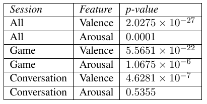

# Emotion Entrainment

## Project Log

### Final corrected acoustic-prosodic entrainment
This is where I spent most of my time this week. I think I finally ironed out the issues in my feature extraction pipeline (there were a few). Here are my results. I omitted speech rate for now - I will address that next.

**Global Convergence**

Feature| p (BMIC games) | p (CGC)
-------|----------|----------
Pitch (Mean)|0.0450|N.S.
Pitch (Max)|0.0109|N.S.
Intensity (Mean)|N.S.|0.01
Shimmer|N.S.|0.03
NHR|N.S.|0.002

Results are not siginficant in the BMIC for conversations or for combined conversations and games.

**Global Proximity**

Feature| p other (BMIC games) | p other (BMIC conversations) | p self (BMIC games) | p self (BMIC conversations) | p self (CGC) | p other (CGC)
-------|----------|----------|---------|--------|--------|--------
Pitch (Mean)|0.3220|0.0332|0.1986|0.0168|N.S.|1.7 10-05
Pitch (Max)|0.0685|0.1806|0.0338|0.1395|0.0008|N.S.
Intensity (Mean)|0.0120|0.9265|0.0085|0.8401|6.1 10-06|0.003
Intensity (Max)|0.0292|0.8648|0.0186|0.9560|0.0002|0.04
Jitter|0.23780|0.1696|0.5590|0.3273|N.S.|4.8 10-05
Shimmer|0.2083|0.4287|0.1165|0.5897|0.05|0.04
NHR|0.7009|0.9475|0.4035|0.5870|0.007|0.009

**Local Convergence**

Feature| r (BMIC games) | p (BMIC games) | r (CGC) | p (CGC)
-------|----------|----------|---------|--------
Pitch (Mean)|0.0094|0.4599|-0.06|4.6 10-11
Pitch (Max)|-0.0047|0.7099|-0.05|4.9 10-08
Intensity (Mean)|0.0444|0.0004|-0.03|0.0001
Intensity (Max)|0.0335|0.0079|-0.02|0.007
Jitter|-0.0163|0.2298|0.03|0.002
Shimmer|0.0090|0.5136|0.0008|N.S.
NHR|0.0296|0.0184|0.007|N.S.

BMIC conversations were only significant for two features:

Feature | r (BMIC conversations) | p (BMIC conversations)
--------|------------------------|-----------------------
Shimmer|-0.0677|0.0028
NHR|0.0442|0.0406

**Local Proximity**

Highly significant differences at turn changes vs. unrelated turns. Seen in BMIC and CGC for all features (pitch mean/max, intensity mean/max, jitter, shimmer, and NHR) for all session types (games and conversations)

**Local Synchrony**

Feature| r (BMIC games) | p (BMIC games) | r (CGC) | p (CGC)
-------|----------|----------|---------|--------
Pitch (Mean)|0.0323|0.0117|0.28|≈ 0
Pitch (Max)|0.0017|0.8924|0.18|≈ 0
Intensity (Mean)|-0.0089|0.4786|0.47|≈ 0
Intensity (Max)|-0.0357|0.0047|0.50|≈ 0
Jitter|0.0644|4.42603 10-6|0.23|≈ 0
Shimmer|0.0349|0.0144|0.16|≈ 0
NHR|0.0840|2.2935 10-11|0.23|≈ 0

For BMIC conversations, only mean pitch was significant with r=-0.0561 and p=0.0103.

**Takeaways and Questions**

We had discussed this before but basically there is not much similarity between the BMIC and CGC. The only highly significant result I got was synchrony, which happened on every feature. Others were hit or miss, with some results exhibiting some significance.

My questions:
1. Does this look right?
1. Are these results worth releasing by themselves?
    - They are what they are: put them in the literature to state what we found.
    - Contextualize them by comparing with other similar datasets: Fischer, Switchboard, CGC. Try to determine what is different about BMIC.

**To do**
Get checked transcripts from Andreas and use them to generate speaking rate.

### Paper
I'd like to talk about these in person.

**Option 1: Short paper (INTERSPEECH, March 30, 4 pages)**
Approx. 65% BMIC, 35% emotional entrainment analysis

**Option 2: Longer paper (~6 pages)**
BMIC, emotional entrainment analysis + acoustic/prosodic entrainment plus upcoming correlation work

### Next steps
* Writing the paper: will start this week
* Correlating acoustic-prosodic features/entrainment with emotion features/entrainment: will continue this week
* What is different about the BMIC and the CGC that yielded different entrainment results, despite having a partially similar format?
* Attempt to recreate a conversation context paper using BMIC

---

I found out I had an outdated version of the dataset, so I had to redo some analysis to bring in the up-to-date data. Additionally, I found out there were multiple annotation attempts, so I needed to rework how I was ingesting the data from the psiturk database. New results can be found here:

Session proximity with partner distance:

Session proximity with self distance:

Turn proximity:

Turn synchrony:

There was no significant evidence for convergence, either turn-level or session-level.

To answer an older outstanding question regarding averaging annotations within turns: only about 7.4% of turns have more than one annotation. There is not a statistically significant difference between the distribution of all turn annotations and the distribution of averaged intra-turn annotations. I think maybe averaging them out is OK. I'm not sure what else I can do because annotators actually leave different amounts of annotations per turn. For example, one might say there is one emotion, while another says there is two or three. I can think of some ways of doing a more detailed analysis accounting for this, but I'm not sure it's worth it right now.

I omitted the incomplete annotator's annotations from the dataset and it didn't seem to make much difference.

Some outstanding paper questions/thoughts:

* What is the best way to frame the outcome and introduction? How much of the 2011 Levitan/Hirschberg paper should I reference, and how much should I copy over?
* Is this the first introduction of this dataset? I should probably spend a while describing it - how much, and in how much detail? Get some paragraphs from Andreas?
* Still thinking about the missing annotations. I also had to omit a session due to technical reasons too.
* Emotion entrainment or affective alignment? The latter seems like it's used more.
* General framing questions - to discuss.

---

**Other emotion dataset analysis**

I spent a while working with the switchboard-sentiment corpus but unfortunately was unable to produce anything worthwhile with it yet. I believe this is because of a difference in how each project annotates emotion. When we do it, it is based on our turn divisions, and the annotator is only listening to a single speaker. In switchboard-sentiment, a sentiment annotation can apply to several turns across both speakers. In fact, the average sentiment annotation applies to about 3.3 turns. This makes it difficult to do the same kind of turn-based entrainment measurement we were doing to our corpus: adjacent turns are often covered by the same annotation, even though the paper acknowledges that there could be disagreements among turns within an annotation. Because of this, I believe my current attempts at looking for entrainment in this dataset are not very accurate. Some outstanding questions:

* I feel this comparative analysis would be useful, but is it useful enough to keep investing so much time into?
* Is it worth trying to salvage the switchboard sentiment corpus, or should I try others?
* What other datasets should I look into?

**Continuing work on our emotion dataset**

I did an analysis of session-level proximity in the style of the Levitan and Hirschberg paper and was unable to find a significant difference between a speaker's emotional state and their partner's versus the emotional state of speakers in sessions with whom they did not speak. I am working on an analysis of the difference between the speaker's emotional state and their partner's versus the emotional state of themselves in other conversations.

In terms of next steps, I am considering the following enhancements to the analysis:

* Currently, I am averaging all the emotions supplied by all annotators for a single turn. I should look into whether there are disagreements between annotators - how many and by how much.
* Currently, I am averaging multiple emotions within a turn. I want to repeat the analysis but account for separate emotions, assuming they apply linearly along the turn. There is some justification for this (annotators were instructed to apply emotions in sequence).
* Turns with missing emotions are not a concern and do not need to be automatically annotated. They represent turns with less than a second of speech.

**Papers**

Andreas gave me these:

Youssef, A. Ben, Chollet, M., Jones, H., Sabouret, N., Pelachaud, C., & Ochs, M. (2015). Towards a Socially Adaptive Virtual Agent. International Conference on Intelligent Virtual Agents, 3–16. https://doi.org/10.1007/978-3-540-85483-8

Acosta, J. C., & Ward, N. G. (2011). Achieving rapport with turn-by-turn, user-responsive emotional coloring. Speech Communication, 53(9), 1137–1148. https://doi.org/10.1016/j.specom.2010.11.006

An updated table with all results is shown below:

---

My next steps are:
* Finish the remaining missing entrainment measures (there were some technical hurdles on global proximity and synchrony).
* Investigate whether emotion prediction techniques can be used to fill in missing emotion data for analysis, in the same way that dialogue act prediction techniques added more data for analysis in that other paper. 
* Entrainment analysis on discrete emotion annotation values. There are the older emotion annotations (before V/A) and that Switchboard dataset with more general positive/negative sentiments. How similar would that be, and is that useful?

---

Here are a set of results from some analysis of extracted emotions based on the various measures of entrainment described in "Measuring acoustic-prosodic entrainment with respect to multiple levels and dimensions".

To get these, I applied the same methodology as described in the paper against valence and arousal separately, as though they were extracted audio features. Additionally, I compared valence and arousal together using Euclidean distance.

Currently, emotion appears to have no global or turn-level convergence (with some exceptions). The most significant forms of entrainment witnessed so far are in turn-level proximity and synchrony. In particular, there appears to be entrainment on the proximity and synchrony of valence, but not arousal.

|                        | V (All)     | A (All) | Distance (All) | V (Game)    | A (Game) | Distance (Game) | V (Conv)    | A (Conv) | Distance (Conv) |
|------------------------|-------------|---------|----------------|-------------|----------|-----------------|-------------|----------|-----------------|
| Global convergence     | 0.41588     | 0.54050 | 0.33413        | 0.26157     | 0.44617  | 0.23013         | 0.87897     | 0.96349  | 0.85888         |
| Turn-level convergence | 0.16226     | 0.12985 |**0.02905**        | **0.02515**     | 0.22459  | **0.01701**         | 0.43663     | 0.33926  | 0.70134         |
| Turn-level proximity   | **2.61404e-09** | 0.06698 | **2.98951e-07**    | **1.68708e-06** | 0.05899  |**1.77216e-05**     | **0.00013**    | 0.62796  | **0.00323**         |
| Turn-level synchrony   | **1.41091e-18** | 0.25623 |                | **9.55685e-11** | 0.13923  |                 | **3.53121e-08** | 0.54941  |                 |

---

I am now pulling emotion information from the Psiturk database. Here are some decisions I made regarding how to process the data:

* If a single turn annotation contains more than one emotion, they are averaged together.
* If a later row describes an annotation for an earlier row which already annotated the same turn, the newer annotation replaces the old.
* If multiple annotators left emotion annotations for the same turn, each annotation is averaged together.
* Earlier rows containing discrete emotional states rather than V/A vectors are ignored.