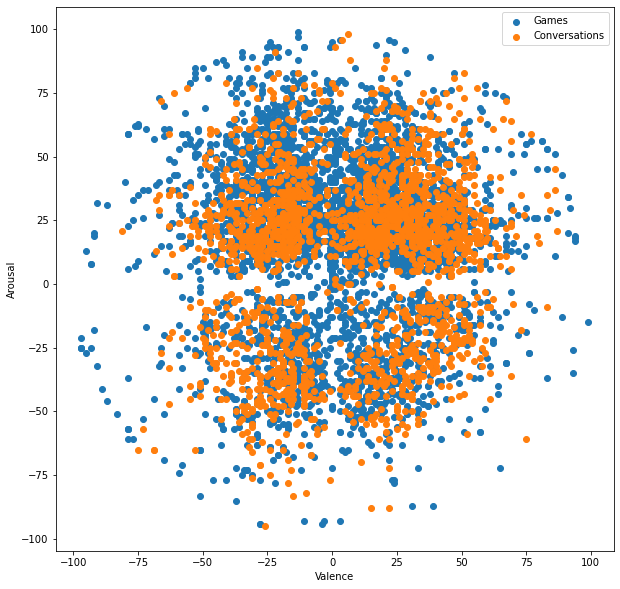
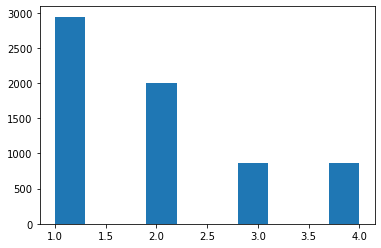
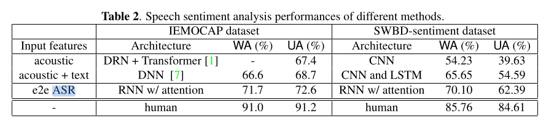

# Emotion Prediction Project

### Introduction
The purpose of this project is to attempt to predict emotions in the Brooklyn Speech Corpus. It is an open-ended project with no specific goal other than to survey the literature and use established techniques to see if it is possible to predict annotated emotions.

What I hope to get out of this:
* An understanding of the Brooklyn Speech Corpus, since I will likely be working with it for the duration of my time at the Graduate Center.
* I am new to speech processing, both in general and in the context of machine learning. Working on this project will familiarize myself with common analysis techniques, metrics, and ML methods unique to speech.
* The data is there, so why not try it?

### Basics
The Brooklyn Speech Corpus contains 96 conversation recordings. Each recording is from a participant, who may be speaking to another participant or to a machine. Conversations are either part of a game, or are open-ended based on some predetermined topic.

Recordings were transcribed and annotated. As part of this, annotators were asked to describe the emotional content of each turn on a circumplex valence/arousal model.

### Log
This section contains notes and thoughts as I work on the project. Relevant information will be cleaned up and moved to better-organized sections above.

---

Emotional content seems to have been recorded using two different methods. 4 earlier annotations (made before August 1, 2020) assigned emotions to a predetermined list of discrete categories. After August 1, emotions were tagged based on a valence/arousal model.

---

As a clunky first attempt, I fed audio waveform data into an LSTM and attempted to predict pre-August emotion categories. It did not do anything useful and actually the model never converged, and I think it's because there isn't enough data (about 1,000 instances). I want to revisit this later but I need to try a different approach.

---

The paper "Emotion recognition and confidence ratings predicted by vocal stimulus type and prosodic parameters" by Lausen and Hammerschmidt contains some useful methods that I recreated.

This work attempts to classify audio recordings into one of seven emotions (angry, disgusted, fearful,
happy, neutral, sad and surprised). It differs from the Brooklyn Speech corpus in a few ways: first, its datasets consist of deliberate portrayals of emotion, whereas the Brooklyn Speech Corpus contains general speech that happens to have an emotion annotation. Second, its models classify speech into one of seven discrete emotion categories, while the majority of Brooklyn Speech Corpus data represents emotion as continuous 2-dimensional vectors.

For simplicity, I'm going to focus on a subset of the prosodic features (mean pitch, jitter, shimmer, and HNR). I'm extracting them with Praat, but since I'm using Python I tried the [Parselmouth wrapper library](https://parselmouth.readthedocs.io/en/stable/).

Also for simplicity, I am dividing the valence/arousal model into quadrants and classifying on those instead of on discrete values.

The paper says using these methods generally has an accuracy of 40% to 57%, which seems pretty low to me but my initial results fell in that range (45%). TODO: Investigate this claim more.

---

I added more features to my dataset from reading the paper "Automatic Emotion Recognition using Auditory and Prosodic Indicative Features" by Gharsellaoui, Selouani, and Dahmane. My dataset now contains the following features:

* Mean/std. deviation/min/max pitch
* Mean/std. deviation/min/max intensity
* Shimmer
* Jitter
* Mean/std. deviation/min/max harmonicity
* Degree of voice breaks
* Fraction of locally unvoiced frames
* Mean/std deviation of 12 MFCCs over the audio sample

This paper is similar to Lausen in that it uses auditory and prosodic features to classify discrete emotions (here, anxiety, contempt, disgust, elation, happiness, hot anger, cold anger, despair, pride, boredom, interest, neutrality, panic, sadness, and shame). Additionally, it uses a dataset consisting of specific examples of emotional speech, whereas the Brooklyn Speech Corpus does not.

Unlike Lausen, this paper was able to reach approximately 80%-94% accuracy depending on the features included and the dimensionality reduction techniques employed as a pre-processing step. Specifically, a range of 90%-91.8% was achieved for a limited subset of prosidic, voice quality, and MFCC features similar to mine. My model achieved about 50% accuracy.

---

I discovered a bias in the dataset toward high-arousal emotions:



This can be better seen in a histogram of each quadrant:



Training on all data, then predicting based on all data, low-arousal, and high-arousal instances produced the following classification reports:

```
All
              precision    recall  f1-score   support

           1       0.51      0.84      0.63       595
           2       0.49      0.30      0.37       369
           3       0.38      0.13      0.20       180
           4       0.49      0.19      0.27       189

    accuracy                           0.50      1333
   macro avg       0.47      0.36      0.37      1333
weighted avg       0.48      0.50      0.45      1333

Negative Arousal
              precision    recall  f1-score   support

           3       0.56      0.13      0.22       180
           4       0.67      0.19      0.29       189

   micro avg       0.62      0.16      0.25       369
   macro avg       0.62      0.16      0.25       369
weighted avg       0.62      0.16      0.25       369

Accuracy:  0.15989159891598917

Positive Arousal
              precision    recall  f1-score   support

           1       0.67      0.84      0.74       595
           2       0.62      0.30      0.40       369

   micro avg       0.66      0.63      0.64       964
   macro avg       0.64      0.57      0.57       964
weighted avg       0.65      0.63      0.61       964

Accuracy:  0.6307053941908713
```

---
Current state of the project:

Results obtained from an SVM predicting one of four quadrants for the emotion. The SVM is currently using default parameters for sklearn. Features are as follows:

* Mean/std. deviation/min/max pitch
* Mean/std. deviation/min/max intensity
* Shimmer
* Jitter
* Mean/std. deviation/min/max harmonicity
* Degree of voice breaks
* Fraction of locally unvoiced frames
* Mean/std deviation of 12 MFCCs over the audio sample

---

Here are some things I'm trying:

Raw dataset, split into 4 quadrants:

```
              precision    recall  f1-score   support

           1       0.51      0.84      0.63       595
           2       0.49      0.30      0.37       369
           3       0.38      0.13      0.20       180
           4       0.49      0.19      0.27       189

    accuracy                           0.50      1333
   macro avg       0.47      0.36      0.37      1333
weighted avg       0.48      0.50      0.45      1333
```

Raw dataset, stratified train/test split:

```
              precision    recall  f1-score   support

           1       0.49      0.82      0.62       589
           2       0.47      0.28      0.35       400
           3       0.32      0.09      0.14       172
           4       0.48      0.18      0.26       172

    accuracy                           0.48      1333
   macro avg       0.44      0.34      0.34      1333
weighted avg       0.46      0.48      0.43      1333
```

Recentered dataset:

```
All
              precision    recall  f1-score   support

           1       0.44      0.67      0.53       451
           2       0.44      0.41      0.42       345
           3       0.35      0.23      0.28       252
           4       0.46      0.25      0.33       285

    accuracy                           0.43      1333
   macro avg       0.42      0.39      0.39      1333
weighted avg       0.43      0.43      0.41      1333
```

Recentered stratified dataset:

```
              precision    recall  f1-score   support

           1       0.44      0.68      0.54       456
           2       0.47      0.38      0.42       374
           3       0.37      0.27      0.31       245
           4       0.41      0.25      0.31       258

    accuracy                           0.44      1333
   macro avg       0.42      0.39      0.39      1333
weighted avg       0.43      0.44      0.42      1333
```

Positive/neutral/negative buckets

```
              precision    recall  f1-score   support

           0       0.44      0.47      0.45       421
           1       0.46      0.47      0.46       440
           2       0.51      0.47      0.49       472

    accuracy                           0.47      1333
   macro avg       0.47      0.47      0.47      1333
weighted avg       0.47      0.47      0.47      1333
```

Stratified positive/neutral/negative buckets

```
All
              precision    recall  f1-score   support

           0       0.50      0.48      0.49       441
           1       0.47      0.43      0.45       439
           2       0.48      0.54      0.51       453

    accuracy                           0.48      1333
   macro avg       0.48      0.48      0.48      1333
weighted avg       0.48      0.48      0.48      1333
```

Stratified positive/neutral/negative buckets for conversations only

```
All
              precision    recall  f1-score   support

           0       0.32      0.39      0.35       134
           1       0.39      0.15      0.22       146
           2       0.39      0.52      0.45       168

    accuracy                           0.36       448
   macro avg       0.36      0.35      0.34       448
weighted avg       0.37      0.36      0.34       448
```

---

Some interesting papers:

"Speech Sentiment Analysis via Pre-Trained Features from End-To-End ASR Models" by Zhiyun et al., based on an annotated Switchboard corpus developed in "A Large Scale Speech Sentiment Corpus" by Chen et al. This is really interesting because they added emotion annotations to Switchboard, which would be really useful to get ahold of. However, their method is much more complex than ours.

Their results are as follows:


This is interesting because our best unweighted accuracy (50%) is better than their worst, but their worst weighted accuracy is better than ours (48%).

Also, I found "Speech emotion recognition: Emotional models, databases, features,
preprocessing methods, supporting modalities, and classifiers" by Akçay and Oğuz. It's a really interesting survey of the current state of emotion prediction from collected audio datasets and gives me a lot of other approaches to look into.

